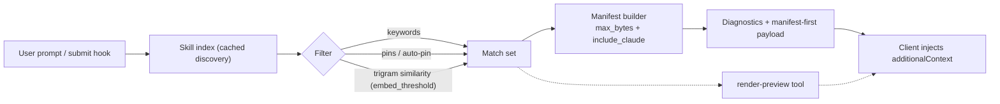

# skrills

Modern Rust MCP server + CLI for discovering, filtering, and injecting local `SKILL.md` files with minimal token overhead.

[](https://github.com/athola/skrills/actions/workflows/ci.yml)
[](https://github.com/athola/skrills/actions/workflows/coverage.yml)
[](https://codecov.io/gh/athola/skrills)
[](https://github.com/athola/skrills/actions/workflows/audit.yml)
[](https://github.com/athola/skrills/actions/workflows/book-pages.yml)

---

## Install
```bash
# from repo root
cargo install --path crates/cli
```

## Why this project
- Maintain local control of skills while ensuring they are discoverable through a consistent MCP contract.
- Optimize prompt usage by employing filtering based on prompt content and embeddings, along with byte limits. This helps prevent large, inefficient prompts.
- Deliver manifest-first payloads and detailed diagnostics, enabling clients to integrate for reliable observability and clear governance.
- Address the [current outstanding issue in the Codex GitHub](https://github.com/openai/codex/issues/5291)

## At a glance
- **Language:** Rust workspace (server/CLI, discovery, state crates)
- **Primary use:** Autoload skills at `UserPromptSubmit` with manifest-first output, with an option for legacy concatenation.
- **Clients:** Any MCP-capable tool (Codex CLI, Claude, custom agents).

### Prebuilt scripts
```bash
# macOS / Linux
curl -LsSf https://raw.githubusercontent.com/${SKRILLS_GH_REPO:-athola/skrills}/HEAD/scripts/install.sh | sh

# Windows
powershell -ExecutionPolicy Bypass -NoLogo -NoProfile -Command "Remove-Item alias:curl -ErrorAction SilentlyContinue; iwr https://raw.githubusercontent.com/athola/skrills/HEAD/scripts/install.ps1 -UseBasicParsing | iex"
```
Flags: `--local` builds from checkout; env `SKRILLS_BIN_DIR`, `SKRILLS_TARGET`, `SKRILLS_VERSION`, `SKRILLS_GH_REPO` override defaults.
Installers now also remove legacy `codex-mcp-skills` binaries and MCP entries to prevent duplicate server registrations.

### Supported platforms
- Linux, macOS, Windows (x86_64); other targets supported by cargo builds.
- MCP transport: stdio (required by newer Codex MCP clients).

## Quickstart
```bash
skrills serve                                   # start MCP server
skrills emit-autoload --prompt "rust tests"     # prompt-filtered manifest+content
skrills render-preview --prompt "rust tests"    # see matched skills + token estimate (no content)
skrills pin context-optimization                # keep a skill always included
```

## How autoload works


## Core features
- **Prompt + embedding filtering:** tokenizes prompt terms and applies a trigram-similarity default (`--embed-threshold`, env `SKRILLS_EMBED_THRESHOLD`) to catch typos while avoiding over-inclusion.
- **Manifest-first payloads:** `[skills] ...` summary plus JSON manifest and full content; toggle legacy concat with `SKRILLS_MANIFEST_FIRST=false`.
- **Diagnostics & observability:** included/skipped/truncated lists; duplicate resolution by priority; `render-preview` reports matched skills, byte size, and token estimate before injection.
- **Pinning:** manual pins plus heuristic auto-pin from recent history.
- **Runtime overrides via MCP:** `runtime-status`, `set-runtime-options`; persisted to `~/.codex/skills-runtime.json`.
- **Claude mirror support:** optional sync from `~/.claude/skills` into `~/.codex/skills-mirror`.

## MCP tools
- `list-skills` — enumerate discovered skills with source and hash.
- `autoload-snippet` — prompt-filtered manifest + content (honors pins, byte budgets).
- `render-preview` — matched skill names, manifest bytes, estimated tokens, truncation flags (no content).
- `runtime-status` / `set-runtime-options` — inspect/persist render overrides (`manifest_first`, `render_mode_log`, `manifest_minimal`).
- `sync-from-claude`, `refresh-cache` — maintenance.

## Configuration
- Env: `SKRILLS_MAX_BYTES`, `SKRILLS_MANIFEST_FIRST`, `SKRILLS_EMBED_THRESHOLD`, `SKRILLS_RENDER_MODE_LOG`, `SKRILLS_INCLUDE_CLAUDE`, `SKRILLS_CACHE_TTL_MS`.
- Manifest: `~/.codex/skills-manifest.json` for priority overrides, TTL, `expose_agents`, etc.
- CLI flags: `--skill-dir`, `--max-bytes`, `--prompt`, `--embed-threshold`, `--auto-pin`, `--include-claude`, `--diagnose`.

## Repository layout
- `crates/server` — MCP server + CLI.
- `crates/discovery` — scanning, hashing, diagnostics.
- `crates/state` — pins/history persistence, env + manifest parsing.
- `crates/cli` — thin binary wrapper.
- `book/` — mdBook user and contributor docs (build via `make book`).
- `docs/` — changelog, runtime options, semver policy, process guidelines, plans.
- `scripts/` — install and sync helpers.

## Documentation links
- User/deep-dive: `book/src/` (CLI, autoload, development, FAQ, Public API & SemVer).
- Runtime options & overrides: `docs/runtime-options.md`.
- SemVer + public API expectations: `docs/semver-policy.md`.
- Release artifacts/process: `docs/release-artifacts.md`, `docs/process-guidelines.md`.
- Changelog: `docs/CHANGELOG.md`.

## Status & roadmap
- Current: pre-1.0, manifest-first default, render-preview for observability, public-API guardrails (`cargo-public-api`).
- Near term: richer diagnostics (per-skill byte and token breakdown), Windows path defaults, optional HTTP transport.
- Tracking: see `docs/CHANGELOG.md` and `docs/plans/` for dated plans.

## Development
```bash
make fmt lint test --quiet
```
Public API guardrails: see `docs/semver-policy.md` and the mdBook “Public API & SemVer” page. CI also runs `cargo-public-api` for the server crate.

## Contributing & support
Issues and PRs welcome. Start with `skrills tui` to pin/sync locally, then follow `docs/process-guidelines.md`. For questions, file an issue with reproduction steps and `runtime-status` output.

## License
[MIT](./LICENSE)

## Star History

[](https://www.star-history.com/#athola/skrills&type=date&legend=top-left)
