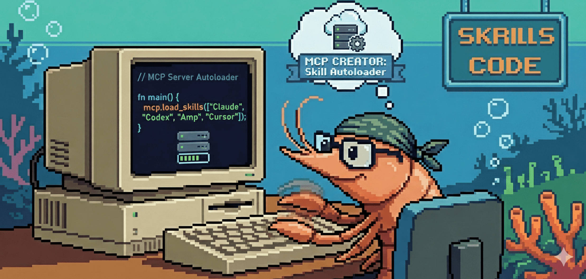

# codex-mcp-skills

<p align="center">
  
</p>

Rust MCP server that exposes local `SKILL.md` files as MCP resources and tools. It mirrors Claude skills, auto-loads relevant skills into Codex prompts, and keeps AGENTS.md in sync for non-MCP agents.

## Contents
- [`crates/core`](crates/core): MCP server and library.
- [`crates/cli`](crates/cli): Binary wrapper (`codex-mcp-skills`).
- [`scripts/`](scripts): Install + sync helpers.
- [`docs/`](docs): Process guidance, FAQ, roadmap (`process-guidelines.md`, `FAQ.md`, `plans/2025-11-22-skill-autoload-mcp.md`).
- [`book/`](book): mdBook with comparison, FAQ, and release details (build via `make book`).
- [`assets/icon.png`](assets/icon.png): Social/brand image (1280×640, 8-bit).

## Features
- **MCP Server**: Exposes all discovered `SKILL.md` files as `skill://` resources over stdio.
- **Skill Autoloader**: Filters skills based on prompt keywords, pinned skills, and priority, then emits a structured JSON output for the agent.
- **Priority System**: A a duplicate-aware priority system determines which skill to use when multiple skills with the same name are found. The default order is `codex` → `mirror` → `claude` → `agent`.
- **Universal Sync**: An optional "universal" mode copies skills to `~/.agent/skills`, allowing them to be reused by other agents.
- **TUI**: A terminal user interface for pinning and unpinning skills, and for syncing skills from Claude to Codex.
- **`AGENTS.md` Sync**: Automatically embeds an `<available_skills>` XML block in `AGENTS.md`, including the priority rank of each skill.
- **Structured Outputs**: All outputs include a `_meta` field with information about priority, duplicates, and ranks.
- **mdBook Documentation**: The project includes an `mdBook` for documentation. Run `make book` to build and open it locally, or `make book-serve` to view it with live-reloading on port 3000.

## Installation

### Standalone installers

We were inspired by the maintainers at [uv](https://github.com/astral-sh/uv?tab=readme-ov-file#installation) to create an intuitive and extensible install script.

```bash
# macOS / Linux
curl -LsSf https://raw.githubusercontent.com/${CODEX_SKILLS_GH_REPO:-athola/codex-mcp-skills}/HEAD/scripts/install.sh | sh

# Windows
powershell -ExecutionPolicy Bypass -NoLogo -NoProfile -Command "Remove-Item alias:curl -ErrorAction SilentlyContinue; iwr https://raw.githubusercontent.com/athola/codex-mcp-skills/HEAD/scripts/install.ps1 -UseBasicParsing | iex"
```
Environment overrides:
- `CODEX_SKILLS_GH_REPO` (default `athola/codex-mcp-skills`)
- `CODEX_SKILLS_VERSION` (tag without `v`, default latest)
- `CODEX_SKILLS_BIN_DIR` (default `~/.codex/bin`)
- `CODEX_SKILLS_TARGET` to force a specific target triple.
- Flag: `--local` builds from the current checkout with cargo instead of downloading a release.

Release asset naming:
- Archives are published per target as `codex-mcp-skills-<target>.tar.gz`, e.g. `codex-mcp-skills-x86_64-unknown-linux-gnu.tar.gz`.
- Archive root should contain the binary `codex-mcp-skills` (`.exe` on Windows).
- Default release repo: `athola/codex-mcp-skills`; override with `CODEX_SKILLS_GH_REPO` if using a fork.

### At a glance: how this compares

| Project type | Primary goal | Install model | Runtime | Key gap vs. codex-mcp-skills |
| --- | --- | --- | --- | --- |
| **codex-mcp-skills** (this project) | MCP server + CLI to surface and sync skills across Codex & Claude | Single binary + hook installers (curl/PowerShell) | MCP over stdio | — |
| Static skill bundles | Publish ready-to-use skill files for manual placement | Copy files into agent skill dirs | None beyond skill files | No MCP server; no cross-agent sync |
| CI doc/render pipelines | Convert SKILL-style docs into prompt-ready text during CI | GitHub/CI workflow | N/A (build-time) | No runtime serving or discovery |
| Shared rules repositories | Curated rules/skills held in a repo | Manual consumption | N/A | No installer or transport layer |
| Local skill sync CLIs | Sync/rank local skills and optionally mirror them | Rust/Node CLIs, `cargo install` or releases | Local file sync only | No MCP server or Codex hook |
| Tutorials/how-to guides | Explain how to author skills | None | N/A | No automation or runtime tooling |

Where we can still improve: tighter version pinning for skills, richer health diagnostics in the MCP server, and first-class Windows path defaults.

### From source
```bash
cargo install --path crates/cli --force
```

### One-step hook + MCP registration (local checkout)
```bash
./scripts/install-codex-skills.sh [--universal] [--universal-only]
```
- Hook written to `~/.codex/hooks/codex/prompt.on_user_prompt_submit`
- MCP server registered in `~/.codex/mcp_servers.json` (with `type = "stdio"` as required by newer Codex MCP clients)
- `--universal` also copies skills into `~/.agent/skills`; `--universal-only` performs just that copy.

## Quick start
```bash
codex-mcp-skills serve                  # start MCP server
codex-mcp-skills list                   # view discovered skills
codex-mcp-skills emit-autoload --prompt "python testing" --diagnose
codex-mcp-skills doctor                 # verify Codex MCP config has type="stdio" and correct paths
codex-mcp-skills tui                    # interactive pin/sync
```
Trigger any Codex prompt; the hook injects filtered `additionalContext` automatically.

## Usage
### Commands (CLI)
- `serve`: Starts the MCP server.
  - `--skill-dir DIR`: Specify one or more directories to search for skills.
  - `--trace-wire`: Trace the wire protocol.
- `emit-autoload`: Emits the autoload snippet.
  - `--include-claude`: Include skills from Claude.
  - `--max-bytes N`: Set the maximum number of bytes for the snippet.
  - `--prompt TEXT`: The prompt to use for filtering skills.
  - `--auto-pin`: Enable or disable auto-pinning.
  - `--diagnose`: Run diagnostics.
  - `--skill-dir DIR`: Specify one or more directories to search for skills.
- `list`: Lists all discovered skills.
- `list-pinned`: Lists all pinned skills.
- `pin <SKILL>`: Pins a skill.
- `unpin <SKILL>`: Unpins a skill.
- `autopin --enable|--disable`: Enables or disables auto-pinning.
- `history`: Shows the history of autoloaded snippets.
  - `--limit N`: Limit the number of entries shown.
- `sync`: Mirrors skills from Claude to Codex.
- `sync-agents`: Writes the `<available_skills>` XML block to `AGENTS.md`.
  - `--path AGENTS.md`: Specify the path to `AGENTS.md`.
  - `--skill-dir DIR`: Specify one or more directories to search for skills.
- `tui`: Starts the terminal user interface for interactive pinning and syncing.
- `doctor`: Checks the Codex MCP configuration for the `codex-skills` entry.

### Structured outputs
`list-skills` returns:
```json
{
  "skills": [{ "name": "...", "source": "...", "priority_rank": 1 }],
  "skills_ranked": [...sorted by priority_rank...],
  "_meta": {
    "duplicates": [{ "name": "...", "kept_source": "codex", "skipped_source": "claude" }],
    "priority": ["codex","mirror","claude","agent"],
    "priority_rank_by_source": { "codex": 1, "mirror": 2, "claude": 3, "agent": 4 }
  }
}
```
`autoload-snippet` includes `content`, `matched`, `skills`, and the same `_meta`.
`readResource` responses carry `_meta.location` and `_meta.priority_rank`.

### Skill discovery & priority
1) `~/.codex/skills`  
2) `~/.codex/skills-mirror`  
3) `~/.claude/skills`  
4) `~/.agent/skills`  
Duplicates are skipped in lower-priority roots. Override with `~/.codex/skills-manifest.json`:
```json
{ "priority": ["agent","codex"], "expose_agents": false }
```
Missing roots auto-append in default order. Environment override: `CODEX_SKILLS_EXPOSE_AGENTS=true|false`.

### Universal skill mirror
```bash
./scripts/install-codex-skills.sh --universal-only
```
Copies `~/.codex/skills` + mirror into `~/.agent/skills` (non-destructive). Env knobs: `CODEX_SKILLS_BIN`, `AGENT_SKILLS_DIR`, `CODEX_SKILLS_DIR`, `CODEX_MIRROR_DIR`.

### AGENTS.md sync
```bash
codex-mcp-skills sync-agents --path AGENTS.md
```
Injects:
```xml
<!-- available_skills:start -->
<available_skills generated_at_utc="..." priority="codex,mirror,claude,agent">
  <skill name="alpha/SKILL.md" source="codex" location="global" path="/home/u/.codex/skills/alpha/SKILL.md" priority_rank="1" />
</available_skills>
<!-- available_skills:end -->
```

## Development
- Workspace: `crates/core` (lib) + `crates/cli` (bin).
- Format/tests: `cargo fmt && cargo test`.
- Helpful scripts: `scripts/install-codex-skills.sh`, `scripts/install-codex-skills.sh --universal-only`.
- Internal docs: 
  * [docs/process-guidelines.md](docs/process-guidelines.md)
  * [docs/release-artifacts.md](docs/release-artifacts.md)
  * [docs/CHANGELOG.md](docs/CHANGELOG.md)
  * [docs/FAQ.md](docs/FAQ.md)

## Roadmap / future work
- Awaiting rmcp resource-level `_meta` to expose `location/priority` directly in `listResources`.
- Optional richer TUI actions (toggle include-claude/auto-pin).

## License
MIT License © 2025 athola. See [LICENSE](LICENSE).

## Acknowledgements
README structure motivated by excellent Rust projects (e.g. [Tokio](https://github.com/tokio-rs/tokio/blob/master/README.md)), emphasizing overview → install → quick start → examples → support.
