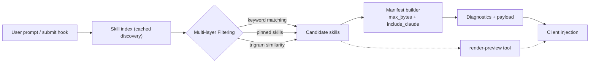

# skrills


**Dynamic skill injection for MCP** — an efficient Rust server that discovers and filters `SKILL.md` files with intelligent matching.

---

[](https://github.com/athola/skrills/actions/workflows/ci.yml)
[](https://github.com/athola/skrills/actions/workflows/coverage.yml)
[](https://codecov.io/gh/athola/skrills)
[](https://github.com/athola/skrills/actions/workflows/audit.yml)
[](https://crates.io/crates/skrills)
[](https://athola.github.io/skrills/)
[](https://opensource.org/licenses/MIT)

---

## Why skrills?

Traditional systems require manual configuration and inject irrelevant context, wasting tokens. `skrills` offers a better approach:

- **Automatically discovering** skills across multiple directories (`~/.codex/skills/`, `~/.claude/skills/`, etc.)
- **Intelligently matching** skills using trigram similarity and keyword analysis
- **Minimizing token usage** through manifest-first rendering and configurable byte limits
- **Providing transparency** with detailed diagnostics showing what was matched and why
- **Integrating seamlessly** with Claude Code via hooks for zero-friction workflows

**Platform Support**: Linux, macOS, Windows (via WSL or native builds)

## Key Features

- **Intelligent Skill Filtering**: Matches skills using keywords, pins, and trigram similarity to ensure only relevant content is included.
- **Transparent Diagnostics**: Provides detailed insights into which skills were matched, skipped, or truncated, aiding in prompt optimization.
- **Claude Code Integration**: Seamlessly integrates with Claude Code via hooks for automatic skill injection on prompt submission.
- **Compact & Debuggable Output**: Employs manifest-first output to keep prompts concise and facilitate easy inspection.
- **Highly Configurable**: Allows extensive customization of skill filtering through environment variables and manifest overrides.
- **Modular Architecture**: Built as a Rust workspace, featuring specialized crates each addressing distinct concerns for improved maintainability.

## Quick Start

### Installation

#### Prebuilt Binaries (Recommended)

##### macOS / Linux

```bash
curl -LsSf https://raw.githubusercontent.com/athola/skrills/HEAD/scripts/install.sh | sh
```

##### Windows (PowerShell)

```powershell
powershell -ExecutionPolicy Bypass -NoLogo -NoProfile -Command `
"Remove-Item alias:curl -ErrorAction SilentlyContinue; iwr https://raw.githubusercontent.com/athola/skrills/HEAD/scripts/install.ps1 -UseBasicParsing | iex"
```

#### From crates.io

```bash
cargo install skrills
```

#### Building from Source

```bash
git clone https://github.com/athola/skrills.git
cd skrills
cargo install --path crates/cli --locked
```

### Basic Usage

```bash
# Start MCP server (stdio transport)
skrills serve

# Preview which skills match your prompt
skrills render-preview --prompt "debugging rust async code"

# Test skill autoload response
skrills emit-autoload --prompt "testing patterns"

# Pin a skill for guaranteed inclusion
skrills pin systematic-debugging

# Check runtime configuration
skrills runtime-status
```

### Claude Code Integration

The installer automatically configures Claude Code hooks. After installation, skills are injected when you submit prompts:

```bash
# Skills matching your prompt context are automatically injected
# No manual configuration needed!
```

See [`docs/demo-claude-hooks.md`](docs/demo-claude-hooks.md) for detailed integration examples.

## How It Works

The following diagram illustrates the workflow of `skrills` from user prompt to client injection:



## Integration Options

### Claude Code (Recommended)

The installer automatically configures hooks to analyze prompts and inject relevant skills via the MCP server cache.

**How it works:**

1. You submit a prompt in Claude Code
2. The hook analyzes your prompt using trigram matching
3. Relevant skills are fetched from the MCP server
4. Skills are injected into your prompt automatically

### Generic MCP Clients

`skrills` implements the standard MCP protocol and works with any MCP-compatible client:

```json
{
  "mcpServers": {
    "skrills": {
      "command": "skrills",
      "args": ["serve"],
      "env": {
        "SKRILLS_MAX_BYTES": "8000"
      }
    }
  }
}
```

See the [MCP Token Optimization guide](book/src/mcp-token-optimization.md) for performance tuning.

## Configuration

### Environment Variables

- `SKRILLS_MAX_BYTES`: Defines the maximum response size (default: 8000 bytes)
- `SKRILLS_EMBED_THRESHOLD`: Sets the similarity threshold for skill matching (default: 0.3)
- `SKRILLS_CACHE_TTL_MS`: Configures the cache duration in milliseconds
- `SKRILLS_MANIFEST_FIRST`: Enables or disables manifest-first mode for skill loading

### Manifest Overrides

To customize skill priorities and Time-To-Live (TTL) settings, create a `~/.codex/skills-manifest.json` file.

### CLI Flags

```bash
skrills --skill-dir /path/to/skills \
         --embed-threshold 0.4 \
         --max-bytes 12000 \
         --diagnose
```

## Documentation

### [Complete Project Book](https://athola.github.io/skrills/)

Comprehensive documentation covering all aspects of `skrills`.

### Quick Links

#### Getting Started

- [Installation Guide](book/src/installation.md)
- [CLI Usage Reference](book/src/cli.md)
- [Runtime Configuration](book/src/runtime-tuning.md)

#### Advanced Topics

- [MCP Token Optimization](book/src/mcp-token-optimization.md)
- [Performance Tuning](book/src/performance.md)
- [Security Considerations](book/src/security.md)
- [Observability & Audit Logging](book/src/observability.md)

#### Development

- [Contributing Guidelines](CONTRIBUTING.md)
- [Development Guide](book/src/development.md)
- [Testing Strategy](book/src/testing.md)
- [SemVer Policy](docs/semver-policy.md)

#### Reference

- [Frequently Asked Questions](docs/FAQ.md)
- [Runtime Options](docs/runtime-options.md)
- [Threat Model](docs/threat-model.md)
- [Changelog](docs/CHANGELOG.md)

## Architecture

`skrills` is structured as a [Rust workspace](https://doc.rust-lang.org/book/ch14-03-cargo-workspaces.html), with the following specialized crates:

- **`server`**: Provides the core Machine-Readable Context Protocol (MCP) server implementation
- **`discovery`**: Handles the scanning and indexing of skill files
- **`state`**: Manages configuration settings and caching mechanisms
- **`cli`**: Implements the command-line interface for `skrills`

## Development Workflow

### Prerequisites

- Rust 1.70+ (Minimum Supported Rust Version - MSRV)
- `make` for executing various development commands

### Setup

```bash
# Clone the repository and build the project
git clone https://github.com/athola/skrills.git
cd skrills
cargo build

# Execute the standard development workflow checks
make fmt lint test

# Generate and open the documentation
cargo doc --open
```

### Testing Strategy

- **Unit Tests**: Dedicated unit tests are provided for each individual crate
- **Integration Tests**: Focus on ensuring compliance with the Machine-Readable Context Protocol (MCP)
- **Property-Based Testing**: Utilizes property-based testing for skill matching algorithms to ensure robustness

## Contributing

Contributions are welcome! Whether you're fixing a bug, improving documentation, or proposing new features, we appreciate your help.

**Before you start:**

- Read the [Contributing Guidelines](CONTRIBUTING.md)
- Check [existing issues](https://github.com/athola/skrills/issues) to avoid duplicates
- Review the [Development Guide](book/src/development.md)

### Bug Reports

Include:

- Clear reproduction steps
- Output of `skrills runtime-status`
- Platform and environment details
- Expected vs. actual behavior

### Pull Requests

- Write tests for new functionality
- Run `make fmt lint test` before submitting
- Follow the [SemVer policy](docs/semver-policy.md)
- Update documentation as needed

See [`AGENTS.md`](AGENTS.md) for AI-assisted development workflows.

## License

This project is distributed under the terms of the [MIT License](LICENSE).

## Related Projects

### MCP Ecosystem

- [Model Context Protocol](https://github.com/modelcontextprotocol/servers) - Official MCP server implementations
- [rmcp](https://github.com/modelcontextprotocol/rust-sdk) - Official Rust SDK for MCP

### Complementary Tools

- [Claude Code](https://claude.com/claude-code) - AI-powered CLI for software development
- Skills repositories implementing `SKILL.md` patterns

## Acknowledgments

Inspired by best-in-class Rust CLI tools:

- [ripgrep](https://github.com/BurntSushi/ripgrep) - Exemplary CLI documentation structure
- [bat](https://github.com/sharkdp/bat) - Installation and configuration patterns
- [clap](https://github.com/clap-rs/clap) - Argument parsing design
- [starship](https://github.com/starship/starship) - Feature presentation approach

---

**Need help?** Check the [FAQ](docs/FAQ.md) or [open an issue](https://github.com/athola/skrills/issues).
