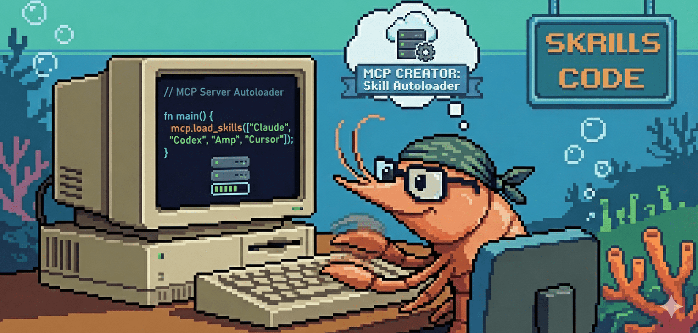

# Skrills

<p align="center">
  
</p>

[](https://crates.io/crates/skrills)
[](https://athola.github.io/skrills/)
[](https://github.com/athola/skrills/actions/workflows/ci.yml)
[](https://github.com/athola/skrills/actions/workflows/coverage.yml)
[](https://github.com/athola/skrills/actions/workflows/audit.yml)
[](LICENSE)

Skills support engine for Claude Code, Codex CLI, GitHub Copilot CLI, and Cursor.

[Installation](book/src/installation.md) |
[User Guide](https://athola.github.io/skrills/) |
[CLI Reference](book/src/cli.md) |
[MCP Tutorial](docs/tutorials/mcp.md) |
[Cursor Quickstart](docs/tutorials/cursor-quickstart.md) |
[FAQ](docs/FAQ.md) |
[Changelog](book/src/changelog.md)

> **What's new in 0.7.2** -- Cursor adapter fixes for
> bidirectional sync reliability, new `sync-from-cursor`,
> `sync-from-claude`, and `sync-from-copilot` shorthand
> commands, and the `tome` research crate for academic paper
> search and PDF retrieval.
> See [changelog](book/src/changelog.md).

## Features

- **Cross-CLI validation** -- validates skills against Claude Code
  (permissive), Codex CLI (strict), Copilot CLI (strict), and Cursor
  rules. Auto-derives missing YAML frontmatter from file paths and content.
- **Multi-directional sync** -- syncs skills, commands, agents, MCP
  servers, rules, and preferences across all four environments. Uses file
  hashing to respect manual edits so user changes are not overwritten.
- **Token analytics** -- measures token usage per skill and suggests
  reductions to fit context windows.
- **Dependency resolution** -- resolves skill dependencies with cycle
  detection and semantic versioning constraints.
- **MCP server** -- 27 tools for validation, sync, intelligence, and
  project-aware skill generation over stdio or HTTP transport.
- **Session mining** -- parses Claude Code and Codex CLI session
  history to improve recommendations based on actual usage.
- **Visualization** -- TUI and browser dashboard showing discovered
  skills, validation status, and usage metrics. The browser dashboard
  supports light and dark modes.
- **Discovery deduplication** -- frontmatter identity matching
  consolidates the same skill installed in multiple locations.

## Demo


See the [quickstart tutorial](docs/tutorials/quickstart.md) for a
walkthrough, or the [MCP tutorial](docs/tutorials/mcp.md) for server
setup.

## Installation

**macOS / Linux:**
```bash
curl -LsSf https://raw.githubusercontent.com/athola/skrills/HEAD/scripts/install.sh | sh
```

**Windows PowerShell:**
```powershell
powershell -ExecutionPolicy Bypass -NoLogo -NoProfile -Command ^
"Remove-Item alias:curl -ErrorAction SilentlyContinue; iwr https://raw.githubusercontent.com/athola/skrills/HEAD/scripts/install.ps1 -UseBasicParsing | iex"
```

**crates.io:** `cargo install skrills`

See [installation guide](book/src/installation.md) for HTTP transport setup, systemd services, and advanced options.

## Quickstart

```bash
# Validate skills for Codex/Copilot/Cursor compatibility
skrills validate --target both --autofix

# Analyze token usage
skrills analyze --min-tokens 1000 --suggestions

# Sync from Claude to all other CLIs
skrills sync-all

# Sync between specific environments
skrills sync --from cursor --to claude

# Start MCP server and open the browser dashboard
skrills serve --http 127.0.0.1:3000 --open

# Interactive TUI dashboard
skrills tui

# Launch an agent with automatic backend routing (Claude → Codex fallback)
skrills multi-cli-agent my-agent
```

See [CLI reference](book/src/cli.md) for all commands including
skill lifecycle management.

## Supported Environments

Skrills syncs seven asset types across four CLI environments.
Each cell reflects what the adapter reads and writes today:

| Asset | Claude Code | Codex CLI | Copilot CLI | Cursor |
|-------|:-----------:|:---------:|:-----------:|:------:|
| Skills | Y | Y | Y | Y |
| Commands | Y | Y | -- | Y |
| Agents | Y | -- | Y | Y |
| MCP Servers | Y | Y | Y | Y |
| Hooks | Y | -- | -- | Y |
| Instructions / Rules | Y | -- | Y | Y |
| Preferences | Y | Y | Y | -- |

Cursor rules (`.mdc` files) are mapped bidirectionally via mode
derivation (`alwaysApply`, glob-scoped, agent-requested).
See [ADR 0006](docs/adr/0006-cursor-rules-mapping.md) for the
mapping strategy and [sync guide](book/src/sync-guide.md) for
workflows.

## Skill Management

Beyond validation and analysis, Skrills provides tools for managing skill lifecycles:

```bash
# Deprecate a skill with migration guidance
skrills skill-deprecate old-skill --replacement "new-skill" --message "Replaced by more efficient version"

# Rollback a skill to a previous version
skrills skill-rollback my-skill --version abc123

# Import skills from external sources
skrills skill-import https://example.com/skill.md
skrills skill-import ~/local/skills/

# Generate usage reports
skrills skill-usage-report --format json > report.json

# Calculate quality scores
skrills skill-score

# Browse and search available skills
skrills skill-catalog --filter "python"

# View skill performance metrics
skrills skill-profile my-skill
```

## Limitations

- **No runtime skill injection**: Skrills validates and syncs
  files; it does not inject skills into prompts at runtime.
- **Copilot command sync**: Copilot CLI does not support slash
  commands, so command sync is skipped.
- **Cursor preferences**: Cursor preferences are not yet mapped;
  preference sync is skipped for Cursor targets.
- **Empirical mining**: Session history parsing works best with
  recent Claude Code / Codex CLI versions.
- **LLM generation**: Requires `ANTHROPIC_API_KEY` or
  `OPENAI_API_KEY` for skill creation.

## Architecture

| Crate | Purpose |
|-------|---------|
| `cli` | Binary entry point (delegates to `server` crate) |
| `server` | MCP server, HTTP transport, security middleware |
| `validate` | Validation logic for Claude/Codex/Copilot/Cursor compatibility |
| `analyze` | Token counting, dependency analysis, optimization |
| `intelligence` | Recommendations, project analysis, skill generation |
| `sync` | Multi-directional sync with adapters for each CLI (Claude, Codex, Copilot, Cursor) |
| `dashboard` | TUI and browser-based skill visualization |
| `discovery` | Skill discovery and ranking |
| `state` | Environment config, manifest settings, runtime overrides |
| `metrics` | SQLite-based telemetry for invocations, validations, sync |
| `subagents` | Shared subagent runtime and backends |
| `tome` | Research API orchestration, caching, PDF serving |
| `test-utils` | Shared test infrastructure (fixtures, RAII guards, temp dirs) |

See [architecture docs](docs/architecture.md) for details.

## Configuration

Create `~/.skrills/config.toml` for persistent settings:

```toml
[serve]
auth_token = "your-secret-token"
tls_auto = true
cors_origins = "https://app.example.com"
```

Precedence: CLI flags > environment variables > config file.

See [security docs](docs/security.md) for TLS setup (`skrills cert`
subcommand) and [FAQ](docs/FAQ.md) for environment variables.

## Documentation

| Resource | Description |
|----------|-------------|
| [User Guide](https://athola.github.io/skrills/) | Primary documentation (mdBook) |
| [CLI Reference](book/src/cli.md) | All commands with examples |
| [MCP Tutorial](docs/tutorials/mcp.md) | Server setup and tool reference |
| [Cursor Quickstart](docs/tutorials/cursor-quickstart.md) | Getting productive with Cursor fast |
| [Sync Guide](book/src/sync-guide.md) | Cross-CLI sync workflows (Claude, Codex, Copilot, Cursor) |
| [Token Optimization](book/src/mcp-token-optimization.md) | Context window management |
| [FAQ](docs/FAQ.md) | Common questions |
| [Security](docs/security.md) | Auth, TLS, threat model |
| [Changelog](book/src/changelog.md) | Release history |

## Development

```bash
make lint test --quiet
```

Requires Rust 1.75+. See [development guide](book/src/development.md) for test coverage, CI, and contribution workflow.

## Contributing

- **Security issues**: See [security policy](docs/security.md) and [threat model](docs/threat-model.md)
- **Bug reports**: Include OS, `skrills --version`, and logs (`--trace-wire` for MCP)
- **Pull requests**: Follow [process guidelines](docs/process-guidelines.md); update docs/tests with code

## License

[MIT](LICENSE)

[](https://www.star-history.com/#athola/skrills&type=date&legend=top-left)
