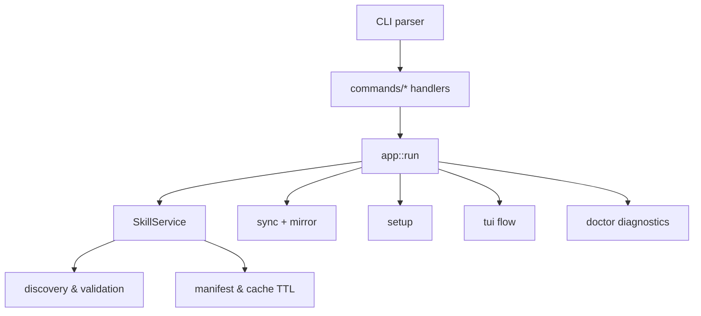
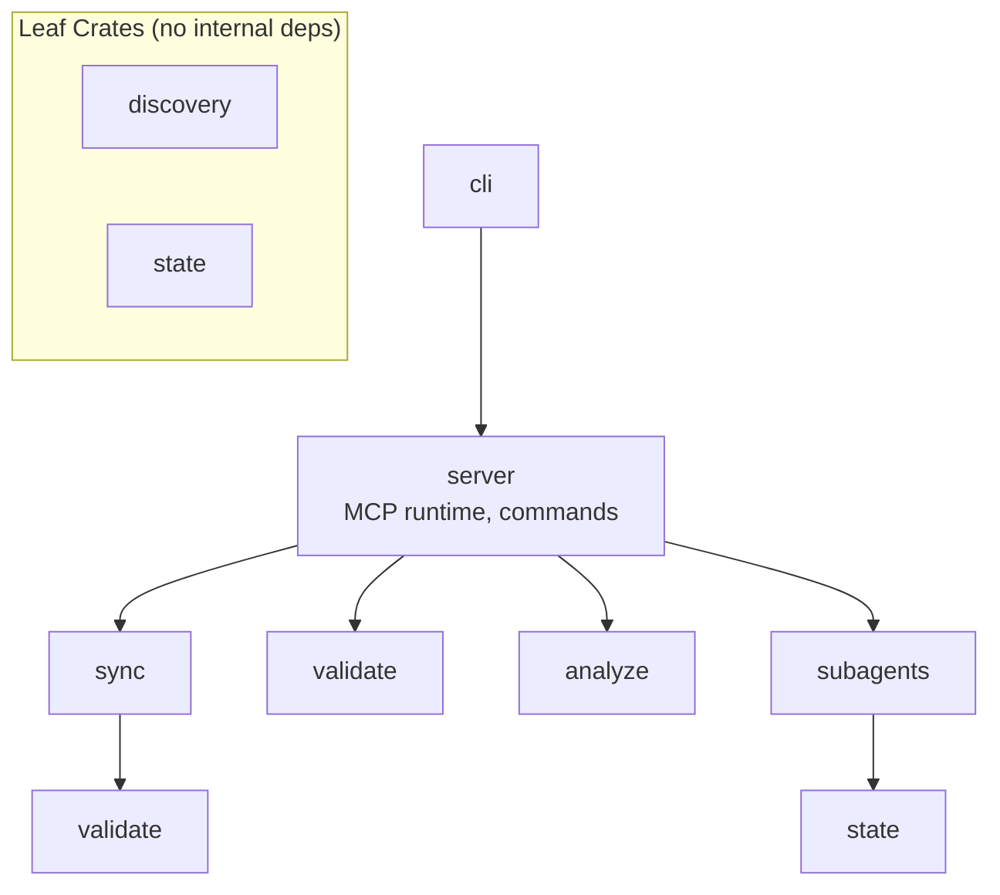

# Architecture

The skrills CLI layers command parsing on top of focused command handlers that delegate to subsystems for discovery, synchronization, and runtime management. At runtime the `app` module wires the CLI to the `SkillService`, which exposes resources and tools over MCP while reusing shared state and discovery utilities.

## Runtime Flow

## Crate Dependency Graph

## Crate Responsibilities

| Crate | Purpose |
|-------|---------|
| `cli` | Thin binary wrapper |
| `server` | MCP server, CLI commands, TUI |
| `sync` | Bidirectional Claude/Codex sync |
| `validate` | Skill validation (Claude/Codex) |
| `analyze` | Token counting, dependencies |
| `discovery` | Skill/agent discovery, ranking |
| `state` | Environment config, persistence |
| `subagents` | Multi-backend agent runtime |

## Design Principles

- **Leaf crates**: `validate`, `analyze`, `discovery`, `state` have no internal dependencies.
- **Trait-based abstraction**: `AgentAdapter` enables pluggable source/target adapters.
- **Feature flags**: `subagents` and `watch` are optional features for smaller binaries.
- **Composition over inheritance**: Generic `SyncOrchestrator<S, T>` uses compile-time dispatch.

## Future Considerations

- Formalize additional ADRs as architecture evolves.
- Split `app.rs` into smaller modules if it grows beyond 2500 LOC.
- Extract command handlers to `commands/` submodules as functionality expands.

## Related Documents

- [ADR 0001: Pivot to Support Engine](adr/0001-pivot-to-support-engine.md)
- [Book: Overview](../book/src/overview.md)
