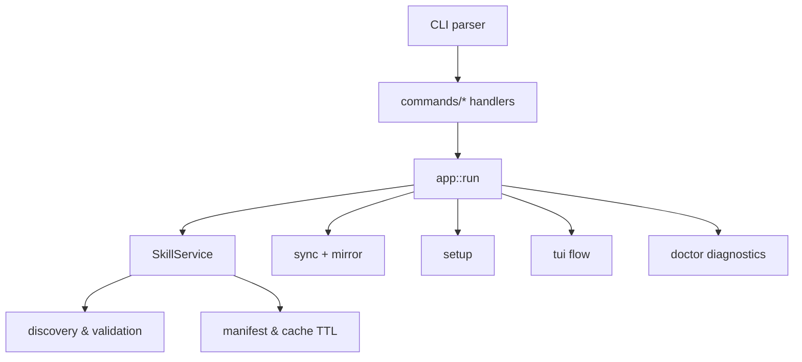
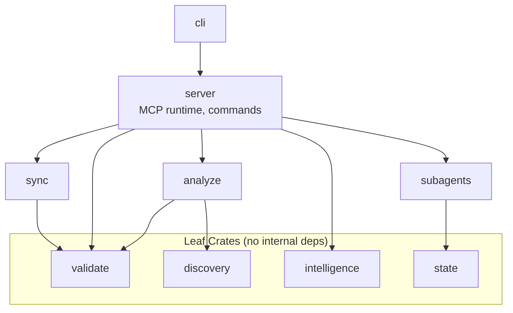

# Architecture

The CLI delegates command parsing to focused handlers that call subsystems for discovery, synchronization, and runtime management. The `app` module connects the CLI to the `SkillService`, which exposes resources and tools over MCP.

## Runtime Flow

## Crate Dependency Graph

## Crate Responsibilities

| Crate | Purpose |
|-------|---------|
| `cli` | Thin binary wrapper |
| `server` | MCP server, CLI commands, TUI |
| `sync` | Bidirectional Claude/Codex/Copilot sync |
| `validate` | Skill validation (Claude/Codex/Copilot) |
| `analyze` | Token counting, dependencies |
| `intelligence` | Recommendations, project analysis, skill generation |
| `discovery` | Skill/agent discovery, ranking |
| `state` | Environment config, persistence |
| `subagents` | Multi-backend agent runtime |

## Design Principles

Leaf crates like `validate`, `discovery`, and `state` have no internal dependencies to prevent cycles. `AgentAdapter` allows pluggable adapters for Claude, Codex, and Copilot, while `SyncOrchestrator<S, T>` uses compile-time dispatch for type safety. We gate features like `subagents` behind flags to minimize binary size.

## Module Organization

The `app` module is split to stay under the 2500 LOC threshold (ADR-0001):

| Module | Lines | Purpose |
|--------|-------|---------|
| `mod.rs` | ~1600 | Core SkillService, MCP handlers, resource serving |
| `intelligence.rs` | ~740 | Intelligence tool implementations |

**LOC Monitoring**: When `app/mod.rs` approaches 2000 lines, extract the next logical group (e.g., subagent tool handlers or resource-serving methods).

## Roadmap

We will extract command handlers to submodules as the CLI grows and align CLI commands with MCP tools. We also plan to consolidate `sync-from-claude` with `sync-all`. `app` module size is monitored to trigger refactoring before it becomes unmanageable.

## Related Documents

- [ADR 0001: Pivot to Support Engine](adr/0001-pivot-to-support-engine.md)
- [ADR 0002: Skill Dependency Resolution](adr/0002-skill-dependency-resolution.md)
- [ADR 0003: CLI Parity for Intelligence Tools](adr/0003-cli-parity-intelligence-tools.md)
- [ADR 0004: Intelligence Crate Versioning](adr/0004-intelligence-crate-versioning.md)
- [Book: Overview](../book/src/overview.md)
