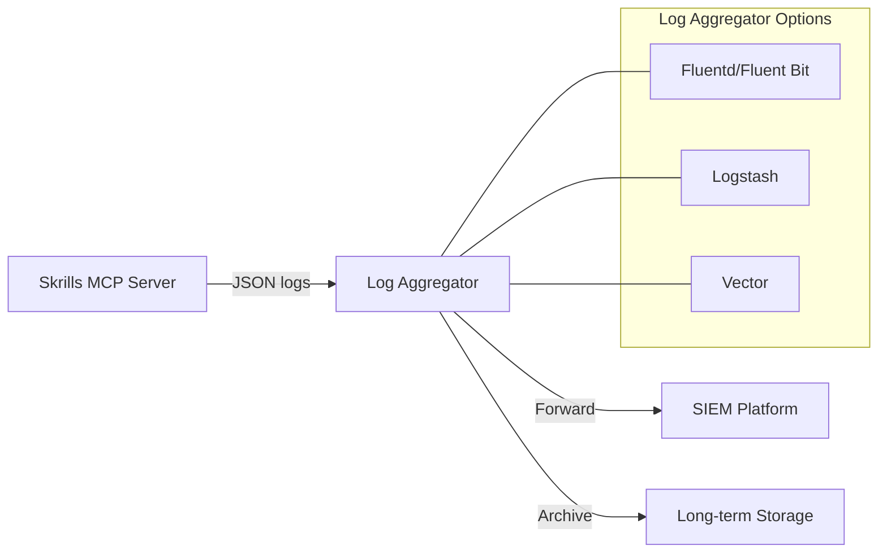

# Audit Logging

## Overview

This document defines audit logging requirements for `skrills` deployments. Audit logging provides visibility into security-relevant events, supports compliance requirements, and enables incident response and forensic analysis.

**Current Status**: Basic logging is implemented via the `tracing` crate. Enhanced audit logging with structured security events is planned.

---

## Security Event Logging Requirements

### Event Categories

Audit logs must capture the following security-relevant events:

| Category | Events | Priority |
|----------|--------|----------|
| **Authentication** | mTLS handshake success/failure, API key validation, certificate expiration warnings | Critical |
| **Authorization** | Access denied events, permission checks, resource access attempts | High |
| **Configuration** | Settings changes, skill directory modifications, cache configuration updates | High |
| **Skill Operations** | Skill discovery, skill loading, skill rendering, cache hits/misses | Medium |
| **System Events** | Server start/stop, graceful shutdown, error conditions | Medium |

### Required Event Fields

Each audit log entry must include:

```json
{
  "timestamp": "2025-01-07T12:00:00.000Z",
  "event_id": "uuid-v4",
  "event_type": "authentication.mtls.failure",
  "severity": "warning",
  "source": {
    "component": "mcp_server",
    "version": "0.4.6"
  },
  "actor": {
    "type": "client",
    "identifier": "client-cert-cn",
    "ip_address": "192.168.1.100"
  },
  "action": {
    "operation": "authenticate",
    "resource": "/mcp/v1/tools",
    "outcome": "failure",
    "reason": "certificate_expired"
  },
  "context": {
    "request_id": "uuid-v4",
    "correlation_id": "uuid-v4"
  }
}
```

### Severity Levels

| Level | Description | Examples |
|-------|-------------|----------|
| **Critical** | Security breach or imminent threat | Authentication bypass, unauthorized access |
| **Error** | Security control failure | Certificate validation error, key rotation failure |
| **Warning** | Potential security issue | Multiple failed auth attempts, certificate near expiry |
| **Info** | Normal security operations | Successful authentication, configuration change |
| **Debug** | Detailed diagnostic data | Full request/response for troubleshooting |

---

## mTLS Authentication Audit Trails

### Certificate Lifecycle Events

Track all certificate-related events for mTLS deployments:

1. **Certificate Presentation**
   - Client certificate received
   - Certificate chain validation initiated
   - CA trust verification

2. **Validation Outcomes**
   - Successful validation (log certificate CN, serial, expiry)
   - Validation failures (log specific reason)
   - Certificate revocation checks (if CRL/OCSP enabled)

3. **Session Events**
   - TLS session establishment
   - Session resumption
   - Session termination

### Example mTLS Audit Log

```json
{
  "timestamp": "2025-01-07T12:00:00.000Z",
  "event_type": "authentication.mtls.success",
  "severity": "info",
  "actor": {
    "certificate": {
      "subject_cn": "claude-code-client",
      "issuer_cn": "skrills-ca",
      "serial": "1234567890ABCDEF",
      "not_after": "2026-01-07T00:00:00Z",
      "fingerprint_sha256": "AB:CD:EF:..."
    },
    "ip_address": "192.168.1.100"
  },
  "action": {
    "operation": "mtls_handshake",
    "outcome": "success",
    "tls_version": "TLSv1.3",
    "cipher_suite": "TLS_AES_256_GCM_SHA384"
  }
}
```

### Authentication Failure Tracking

Monitor and alert on authentication anomalies:

- Failed authentication attempts per client
- Geographic anomalies (if IP geolocation enabled)
- Time-based patterns (unusual access hours)
- Certificate anomalies (unexpected issuers, short validity periods)

---

## SIEM Integration Guidance

### Log Format Recommendations

For SIEM integration, logs should be emitted in one of these formats:

| Format | Use Case | Configuration |
|--------|----------|---------------|
| **JSON Lines** | General SIEM ingestion | Default structured output |
| **CEF** | ArcSight, QRadar | `SKRILLS_LOG_FORMAT=cef` |
| **LEEF** | IBM QRadar | `SKRILLS_LOG_FORMAT=leef` |
| **Syslog (RFC 5424)** | Traditional SIEM | `SKRILLS_LOG_FORMAT=syslog` |

### Log Shipping Architecture



### Integration Examples

#### Splunk

```bash
# Forward logs to Splunk HEC
skrills serve 2>&1 | \
  jq -c '. | {event: ., sourcetype: "skrills:audit"}' | \
  curl -X POST "https://splunk-hec:8088/services/collector" \
    -H "Authorization: Splunk $HEC_TOKEN" \
    -d @-
```

#### Elastic Stack

```yaml
# Filebeat configuration
filebeat.inputs:
  - type: log
    paths:
      - /var/log/skrills/audit.log
    json.keys_under_root: true
    json.add_error_key: true

output.elasticsearch:
  hosts: ["elasticsearch:9200"]
  index: "skrills-audit-%{+yyyy.MM.dd}"
```

#### AWS CloudWatch

```bash
# Configure CloudWatch agent
{
  "logs": {
    "logs_collected": {
      "files": {
        "collect_list": [
          {
            "file_path": "/var/log/skrills/audit.log",
            "log_group_name": "skrills-audit",
            "log_stream_name": "{instance_id}",
            "timestamp_format": "%Y-%m-%dT%H:%M:%S.%fZ"
          }
        ]
      }
    }
  }
}
```

### Alerting Recommendations

Configure SIEM alerts for:

| Alert | Condition | Severity |
|-------|-----------|----------|
| **Brute Force Detection** | > 5 auth failures from same source in 5 minutes | High |
| **Certificate Expiry** | Certificate expires within 30 days | Medium |
| **Unauthorized Access** | Any authorization denied event | High |
| **Configuration Change** | Any configuration modification | Medium |
| **Service Disruption** | Server restart or error spike | High |

---

## Compliance

### GDPR Considerations

The General Data Protection Regulation (GDPR) requires specific considerations for audit logging:

1. **Data Minimization**
   - Log only necessary data for security purposes
   - Avoid logging full user prompts (processed ephemerally by design)
   - Use pseudonymization where possible

2. **Retention Limits**
   - Define and enforce log retention periods
   - Recommended: 90 days for operational logs, 1 year for security events
   - Implement automated log rotation and deletion

3. **Access Controls**
   - Restrict audit log access to authorized personnel
   - Log access to audit logs (meta-auditing)
   - Implement role-based access control for log systems

4. **Data Subject Rights**
   - Document what personal data appears in logs
   - Establish procedures for data subject access requests
   - Ensure logs can be included in data erasure processes if required

### SOC 2 Requirements

SOC 2 Type II compliance requires demonstrable audit logging controls:

#### Trust Service Criteria Mapping

| TSC | Requirement | Implementation |
|-----|-------------|----------------|
| **CC6.1** | Logical access controls | Log all authentication events |
| **CC6.2** | Access restrictions | Log authorization decisions |
| **CC6.3** | Access removal | Log session terminations and certificate revocations |
| **CC7.1** | Security events detection | Real-time log monitoring |
| **CC7.2** | Security incidents | Alert on anomalous patterns |
| **CC7.3** | Incident response | Searchable audit trails for investigation |

#### Evidence Collection

Maintain audit logs that demonstrate:

- All access attempts (successful and failed)
- Changes to security configurations
- Administrative actions
- Incident detection and response activities

### Log Integrity

For compliance, audit logs must be tamper-evident:

1. **Immutable Storage**
   - Write logs to append-only storage
   - Use WORM (Write Once Read Many) storage for long-term retention

2. **Cryptographic Integrity**
   - Consider log signing for critical events
   - Implement hash chaining for log sequence verification

3. **Access Auditing**
   - Log all access to audit logs
   - Restrict modification capabilities

---

## Configuration

### Environment Variables

| Variable | Description | Default |
|----------|-------------|---------|
| `SKRILLS_AUDIT_ENABLED` | Enable audit logging | `false` |
| `SKRILLS_AUDIT_LEVEL` | Minimum severity to log | `info` |
| `SKRILLS_AUDIT_FORMAT` | Output format (json, cef, syslog) | `json` |
| `SKRILLS_AUDIT_OUTPUT` | Output destination (stdout, file, syslog) | `stdout` |
| `SKRILLS_AUDIT_FILE` | Path to audit log file | `/var/log/skrills/audit.log` |
| `SKRILLS_AUDIT_RETENTION_DAYS` | Log retention period | `90` |

### Example Configuration

```toml
# skrills.toml
[audit]
enabled = true
level = "info"
format = "json"
output = "file"
file = "/var/log/skrills/audit.log"
retention_days = 90

[audit.events]
authentication = true
authorization = true
configuration = true
skill_operations = false  # Disable for high-volume environments
```

---

## Implementation Roadmap

| Phase | Features | Target |
|-------|----------|--------|
| **Phase 1** | Structured audit events, JSON output | v0.5.0 |
| **Phase 2** | SIEM format support (CEF, LEEF, syslog) | v0.6.0 |
| **Phase 3** | Tamper-evident logging, log signing | v0.7.0 |
| **Phase 4** | Real-time alerting integration | v0.8.0 |

---

## Related Documents

- [Security Overview](security.md)
- [Threat Model](threat-model.md)
- [Secrets Management](secrets-management.md) (TODO)
- [Rate Limiting](rate-limiting.md) (TODO)

---

## References

- [OWASP Logging Cheat Sheet](https://cheatsheetseries.owasp.org/cheatsheets/Logging_Cheat_Sheet.html)
- [NIST SP 800-92: Guide to Computer Security Log Management](https://csrc.nist.gov/publications/detail/sp/800-92/final)
- [SOC 2 Trust Service Criteria](https://www.aicpa.org/interestareas/frc/assuranceadvisoryservices/sorhome)
- [GDPR Article 30: Records of Processing Activities](https://gdpr-info.eu/art-30-gdpr/)
- [CIS Controls: Audit Log Management](https://www.cisecurity.org/controls)

---

## Document History

| Version | Date | Changes |
|---------|------|---------|
| 1.0 | 2025-01-07 | Initial audit logging documentation |
