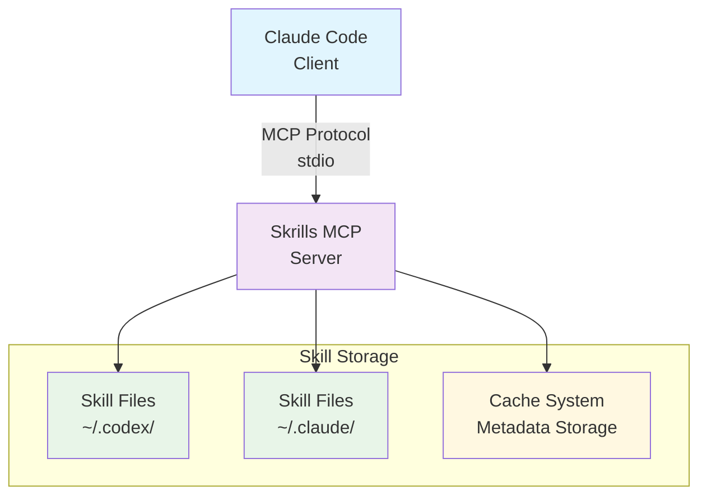

# Skrills Threat Model

## Document Status

**Version**: 1.0
**Last Updated**: 2025-11-30
**Owner**: Security Team

---

## Executive Summary

This document details the threat model for `skrills`, an MCP server for dynamic skill injection. It identifies key assets, potential threat actors, attack vectors, and proposed mitigations to manage security risks.

---

## System Overview

### Architecture
The following diagram illustrates the high-level architecture of `skrills` and its interactions:

### Components

1. **MCP Server**: Handles skill discovery and rendering operations via stdio protocol.
2. **Skill Discovery**: Scans the filesystem and loads skill definitions from configured directories.
3. **Cache System**: In-memory cache for skill metadata, to improve retrieval performance.
4. **Configuration**: Manages settings through TOML/JSON files and environment variables.

---

## Assets

### Critical Assets

| Asset | Description | Confidentiality | Integrity | Availability |
|---|---|---|---|---|
| **Skill Content** | `SKILL.md` files, which contain prompts, workflows, and other operational logic for skills. | Medium | High | High |
| **User Prompts** | User inputs, which are processed by the system for skill matching and context injection. | High | High | Medium |
| **Configuration** | Server settings, including operational parameters, file paths, and credentials. | High | High | Medium |
| **Cache Data** | Cached data of skill metadata and embeddings, used for performance optimization. | Medium | Medium | Low |

### Data Classification
- **Critical**: This classification includes highly sensitive assets such as TLS private keys, API keys, and signing keys, which would have a severe impact if compromised.
- **High**: Assets in this category, like user prompts, configuration files, and skill content, carry a significant risk if compromised.
- **Medium**: This level applies to assets such as cached embeddings and skill metadata, which, if exposed, would have a moderate impact.
- **Low**: Assets like operational logs, performance metrics, and temporary files fall into this category and would have minimal impact if compromised.

---

## Threat Actors

### Internal Threats
1. **Malicious Plugin Author**: A malicious plugin author can create or modify `SKILL.md` files. Motivations typically involve code injection, data exfiltration, or other forms of subversion. Capability: Medium to High.
2. **Compromised User Account**: A compromised user account grants an attacker full filesystem access. Motivations can range from data theft to privilege escalation. Capability: High.

### External Threats
1. **Malicious Client**: A malicious client, with access to the MCP protocol, might attempt resource exhaustion or unauthorized data extraction. Capability: Low to Medium.
2. **Supply Chain Attack**: A supply chain attack involves compromised dependencies. Motivations can include backdoor installation or data theft. Capability: High.

---

## Attack Vectors & Threats

### 1. Skill Injection Attacks
- **Threat**: Malicious skill files are used to inject harmful prompts or code into the system.
- **Scenarios**: A common scenario involves an attacker placing a malicious `SKILL.md` file (containing prompt injection payloads) within a designated skill directory such as [`~/.codex/skills/`](~/.codex/skills/). When a user loads this skill, the client (e.g., Claude) may execute the injected instructions.
- **Impact**: High: This can lead to unauthorized command execution, data exfiltration, or a broader system compromise.
- **Mitigations**: Skill content is treated as untrusted input. The system does not execute skill content server-side. Client-side validation is crucial. Future enhancements include recommending skill signing and verification, and implementing skill allowlisting.
- **Residual Risk**: Medium.

### 2. Path Traversal Attacks
- **Threat**: An attacker attempts to access files or directories outside the authorized skill directories.
- **Scenarios**: Scenarios include a malicious skill defining a path like `../../etc/passwd`, a symlink attack, or an MCP client requesting a resource using a path traversal sequence.
- **Impact**: Medium: Potential consequences include information disclosure, unauthorized access to configuration files, and possible credential theft.
- **Mitigations**: Mitigations include robust path canonicalization within the `resolve_skill()` function, strict validation of all file paths, preventing arbitrary file access, and restricting skill root directories to only known and trusted locations.
- **Residual Risk**: Low.

### 3. Denial of Service (DoS)
- **Threat**: Resource exhaustion initiated through malicious or excessive requests.
- **Scenarios**: Potential scenarios include uploads of excessively large skill files, memory exhaustion via cache poisoning, or CPU exhaustion triggered by intensive embedding generation.
- **Impact**: Medium: This can lead to service unavailability, severe performance degradation, and excessive resource consumption.
- **Mitigations**: Mitigations include enforcing strict file size limits, using cache Time-To-Live (TTL) to prevent unbounded cache growth, enforcing request timeouts, and establishing concurrent request limits.
- **Residual Risk**: Medium.

### 4. Information Disclosure
- **Threat**: The unintentional leakage of sensitive data through logs or error messages.
- **Scenarios**: Scenarios include API keys being logged in plaintext, user prompts appearing in debug logs, the exposure of internal filesystem paths, or stack traces revealing sensitive data.
- **Impact**: Medium: Consequences may include credential compromise, privacy violations, and an expanded attack surface.
- **Mitigations**: Mitigations include structured logging, careful configuration of log levels, scrubbing credentials from logs (planned), redacting prompts in telemetry (planned), and sanitizing error messages (planned).
- **Residual Risk**: Medium.

### 5. Dependency Vulnerabilities
- **Threat**: Exploitation of vulnerabilities present in third-party crates or libraries.
- **Scenarios**: Scenarios include known Common Vulnerabilities and Exposures (CVEs) in direct or transitive dependencies, supply chain compromises, or vulnerabilities within indirectly linked dependencies.
- **Impact**: Varies: The impact can range from low to critical, potentially leading to Remote Code Execution (RCE), data theft, or complete service compromise.
- **Mitigations**: Mitigations include regular and timely dependency updates, integrating `cargo audit` into the CI/CD pipeline, maintaining a minimal dependency footprint, establishing a rigorous dependency review process, implementing automated vulnerability scanning (planned), and generating a Software Bill of Materials (SBOM) (planned).
- **Residual Risk**: Low.

### 6. Cache Poisoning
- **Threat**: The injection of malicious or corrupted data into the system's cache.
- **Scenarios**: Scenarios include undetected modifications to skill files, hash collision attacks, or cache corruption due to race conditions.
- **Impact**: Medium: Potential impact involves skill content manipulation, Denial of Service (DoS) through cache invalidation, or incorrect skill rendering.
- **Mitigations**: Mitigations include hash-based cache validation, checks against file modification times, Time-To-Live (TTL)-based expiration, atomic cache operations, and implementing cache integrity verification (planned).
- **Residual Risk**: Low.

### 7. Configuration Tampering
- **Threat**: Unauthorized modification of system configuration settings.
- **Scenarios**: Scenarios include direct modification of configuration files, injection of malicious environment variables, or exploitation of runtime override mechanisms.
- **Impact**: High: This can lead to privilege escalation, bypass of security controls, and critical service misconfiguration.
- **Mitigations**: Mitigations include restrictive file permissions, robust configuration validation, establishing secure default settings, and planning for configuration signing/checksums and an immutable configuration mode.
- **Residual Risk**: Medium.

---

## Security Controls

### Implemented Controls

#### Authentication & Authorization
- **Process Isolation (Local Stdio Mode)**: By design, local standard I/O (stdio) mode deployments rely on inherent process isolation and filesystem permissions. The MCP server runs as the user's process.
- **Future: Network Authentication**: For future network-exposed deployments, mTLS and API key authentication are planned.

#### Network Security
- **TLS 1.3 Enforcement**: Strict enforcement of TLS 1.3 protocols, ensuring the use of modern cryptographic standards.
- **Strong Cipher Suites**: Uses robust cipher suites, such as AES-256-GCM and ChaCha20-Poly1305, to maintain strong encryption.
- **Certificate Validation**: Implements comprehensive certificate validation, including chain-of-trust and expiration checks.
- **Configurable Bind Addresses**: Allows for flexible configuration of network bind addresses for enhanced security and deployment options.

#### Input Validation
- **Path Canonicalization and Validation**: Prevents path traversal vulnerabilities through strict canonicalization and validation of all incoming paths.
- **File Size Limits**: Enforces configurable file size limits to prevent resource exhaustion attacks.
- **JSON Schema Validation for MCP Messages**: Validates all Machine-Readable Context Protocol (MCP) messages against predefined JSON schemas.
- **Skill Metadata Validation**: Ensures the integrity and correctness of skill metadata through rigorous validation processes.

#### Data Protection
- **No Persistent User Prompt Storage**: User prompts are processed ephemerally and are never persistently stored, preserving user privacy.
- **Ephemeral Cache with TTL**: Uses an ephemeral, time-to-live (TTL) based cache to manage transient data efficiently.
- **Secure File Permissions**: Recommendations for secure file permissions are provided to protect sensitive data at rest.

#### Logging & Monitoring
- **Structured Logging**: Implements structured logging using the `tracing` crate for improved observability and analysis.
- **Configurable Log Levels**: Allows for dynamic adjustment of log verbosity to manage data volume and focus on critical events.
- **Error Tracking**: Incorporates mechanisms for effective error tracking and reporting.

---

### Recommended Controls (TODO)

#### Rate Limiting
- Per-client request rate limits to ensure fair usage.
- Global concurrent connection limits to protect overall service capacity.
- Throttling of embedding generation for resource optimization.
- Configurable burst allowances for legitimate traffic spikes.

**See**: Rate Limiting Configuration (TODO: create docs/rate-limiting.md)

#### Audit Logging
- Detailed logging of authentication failures.
- Recording of authorization decisions.
- Tracking of all configuration changes.
- Auditing of skill access and usage.

**See**: Audit Logging (TODO: create docs/audit-logging.md)

#### Secrets Management
- Robust key rotation mechanisms.
- Integration with Hardware Security Modules (HSMs) for key protection.
- Encrypted storage for sensitive configuration data.
- Documentation detailing secrets management procedures.

**See**: Secrets Management (TODO: create docs/secrets-management.md)

#### Additional Hardening
- Implementation of skill signing and verification for content integrity.
- Enforcement of security headers for any web-exposed interfaces.
- Integration of automated security testing into the development pipeline.

---

## Trust Boundaries

### Boundary 1: User to Skrills Server (stdio)
- **Trust Level**: High (operating on the same machine).
- The user has direct control over filesystem access.
- Skill content is treated as user-provided input.
- There is no network exposure in this mode.
- The integrity of this boundary depends on the security of the user account.
- **Controls**: Implemented controls include rigorous file permission checks, strict path validation, and the absence of remote access capabilities.

### Boundary 2: Skrills to Skill Files
- **Trust Level**: Medium (due to user-controlled content).
- Skill files may contain malicious prompts.
- Requires filesystem access to load skill definitions.
- Skill content is explicitly not executed server-side.
- Metadata is cached, and content is passed through.
- **Controls**: Implemented controls include strict path validation, file size limits, prevention of skill content execution, and hash-based integrity checks.

---

## Deployment Models & Risk Profiles

### Local stdio Mode (Default)
- **Risk Profile**: Low to Medium. This mode has no network exposure and is typically for a single user. Filesystem security is critical.
- **Threats**: Key threats include malicious skill injection, configuration tampering, and local privilege escalation.
- **Controls**: Mitigations involve strict file permissions (e.g., `chmod 600`), regular audits of skill directories, and robust user account security practices.

---

## Compliance Considerations

### GDPR (User Prompts as Personal Data)
- User prompts may contain personal information. To address this, the system does not persistently store prompts, processing them ephemerally. Cache Time-To-Live (TTL) mechanisms further limit data retention.

### Security Frameworks
- **OWASP Top 10**: We address key risks from the OWASP Top 10, such as Injection, Broken Authentication, and Sensitive Data Exposure.
- **CWE Top 25**: We consider the CWE Top 25, focusing on preventing issues like Path Traversal, Missing Authentication, and Resource Exhaustion.
- **NIST CSF**: Our security practices align with the NIST Cybersecurity Framework, encompassing its core functions: Identify, Protect, Detect, Respond, and Recover.

**See**: [Compliance in `AUDIT-LOGGING.md`](AUDIT-LOGGING.md#compliance)

---

## Incident Response

### Security Event Classifications
1. **Critical**: Events such as authentication bypass or remote code execution that demand immediate attention.
2. **High**: Events involving data exfiltration or credential theft.
3. **Medium**: Events like Denial-of-Service (DoS) attacks or information disclosure.
4. **Low**: Less severe events such as configuration errors or logging issues.

### Response Procedures
1. **Detection**: Monitor logs for authentication failures and unusual patterns.
2. **Containment**: Take immediate measures such as stopping the MCP server and rotating compromised credentials.
3. **Investigation**: Conduct a thorough review of audit logs and verify skill integrity.
4. **Recovery**: Restore the system from a known-good state and apply necessary patches for identified vulnerabilities.
5. **Lessons Learned**: Update the threat model based on the incident, and implement improved security controls.

---

## Security Testing

### Recommended Testing
- **Unit Tests**: Focus on input validation and path sanitization routines.
- **Integration Tests**: Verify MCP protocol handling and skill discovery processes.
- **Fuzz Testing**: Use fuzzing for MCP message parsing and skill file parsing to uncover unexpected behaviors or vulnerabilities.
- **Penetration Testing**: Conduct comprehensive penetration tests targeting MCP endpoints and file handling.
- **Dependency Scanning**: Use tools like `cargo audit` for automated CVE checks against project dependencies.

---

## Future Enhancements

### Roadmap
1. **Skill Signing (Q1 2026)**: Implement cryptographic signatures for skills, establish publisher verification processes, and develop a robust trust framework.
2. **Rate Limiting (Q4 2025)**: Introduce a token bucket algorithm for rate limiting, implement per-client limits, and provide flexible configuration options.
3. **Audit Logging (Q4 2025)**: Develop structured audit events, implement tamper-evident logs, and enable seamless SIEM integration.
4. **Secrets Management (Q1 2026)**: Automate key rotation, integrate with Hardware Security Modules (HSM), and provide HashiCorp Vault support.

---

## References

- [OWASP Threat Modeling](https://owasp.org/www-community/Threat_Modeling)
- [STRIDE Methodology](https://docs.microsoft.com/en-us/azure/security/develop/threat-modeling-tool-threats)
- [MCP Security Considerations](https://spec.modelcontextprotocol.io/specification/architecture/#security-considerations)
- [Rust Security Guidelines](https://rust-lang.github.io/api-guidelines/security.html)
- [CIS Benchmarks](https://www.cisecurity.org/cis-benchmarks/)
- [NIST Cybersecurity Framework](https://www.nist.gov/cyberframework)

---

## Document Maintenance

Review and update this threat model:
- **Quarterly**: A regular review is conducted quarterly.
- **On Architecture Changes**: Updated on significant architectural changes, such as new features or protocol modifications.
- **After Security Incidents**: Updated to incorporate lessons learned from security incidents.
- **On Vulnerability Disclosure**: Revised following the disclosure of new vulnerabilities or attack vectors.

**Next Review**: 2026-02-28

---

*This document is maintained by the `skrills` security team. For any questions or concerns, please open an issue on GitHub or directly contact the security team at `security@example.com`.*
