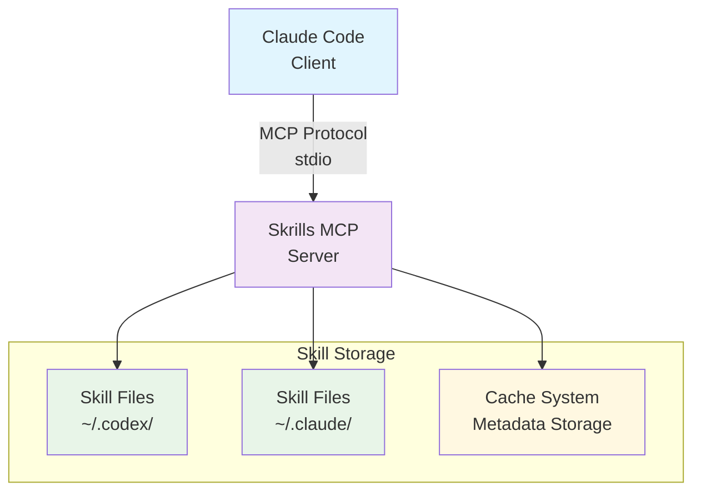

# Skrills Threat Model

## Document Status

**Version**: 1.0
**Last Updated**: 2025-11-30
**Owner**: Security Team

---

## Executive Summary

This document identifies key assets, potential threat actors, attack vectors, and mitigations for `skrills`, an MCP server for dynamic skill injection.

---

## System Overview

### Architecture
The following diagram illustrates the high-level architecture of `skrills` and its interactions:

### Components

1. **MCP Server**: Handles skill discovery and rendering operations via stdio protocol.
2. **Skill Discovery**: Scans the filesystem and loads skill definitions from configured directories.
3. **Cache System**: In-memory cache for skill metadata to improve retrieval performance.
4. **Configuration**: Manages settings through TOML/JSON files and environment variables.

---

## Assets

### Critical Assets

| Asset | Description | Confidentiality | Integrity | Availability |
|---|---|---|---|---|
| **Skill Content** | `SKILL.md` files containing prompts, workflows, and operational logic. | Medium | High | High |
| **User Prompts** | User inputs processed for skill matching and context injection. | High | High | Medium |
| **Configuration** | Server settings, parameters, file paths, and credentials. | High | High | Medium |
| **Cache Data** | Cached skill metadata and embeddings. | Medium | Medium | Low |

### Data Classification
- **Critical**: TLS private keys, API keys, signing keys. Compromise impact: Severe.
- **High**: User prompts, configuration files, skill content. Compromise impact: Significant.
- **Medium**: Cached embeddings, skill metadata. Compromise impact: Moderate.
- **Low**: Operational logs, performance metrics, temporary files. Compromise impact: Minimal.

---

## Threat Actors

### Internal Threats
1. **Malicious Plugin Author**: Creates/modifies `SKILL.md` files for code injection or subversion. Capability: Medium to High.
2. **Compromised User Account**: Grants full filesystem access for data theft or escalation. Capability: High.

### External Threats
1. **Malicious Client**: Attempts resource exhaustion or unauthorized data extraction via MCP protocol. Capability: Low to Medium.
2. **Supply Chain Attack**: Compromises dependencies for backdoor installation or data theft. Capability: High.

---

## Attack Vectors & Threats

### 1. Skill Injection Attacks
- **Threat**: Malicious skill files inject harmful prompts or code.
- **Scenarios**: An attacker places a malicious `SKILL.md` (with prompt injection payloads) in a skill directory (e.g., [`~/.codex/skills/`](~/.codex/skills/)). The client executes the injected instructions upon loading.
- **Impact**: High. Unauthorized command execution, data exfiltration, or system compromise.
- **Mitigations**: Treat skill content as untrusted input. Do not execute skill content server-side. Validate client-side. Recommend skill signing/verification and allowlisting.
- **Residual Risk**: Medium.

### 2. Path Traversal Attacks
- **Threat**: Accessing files or directories outside authorized skill directories.
- **Scenarios**: A malicious skill defines a path like `../../etc/passwd`, uses symlinks, or an MCP client requests a resource with traversal sequences.
- **Impact**: Medium. Information disclosure, unauthorized access to configuration, credential theft.
- **Mitigations**: Canonicalize paths in `resolve_skill()`, strict validation, prevent arbitrary file access, restrict skill roots to trusted locations.
- **Residual Risk**: Low.

### 3. Denial of Service (DoS)
- **Threat**: Resource exhaustion via malicious or excessive requests.
- **Scenarios**: Uploading large skill files, cache poisoning (memory exhaustion), or intensive embedding generation (CPU exhaustion).
- **Impact**: Medium. Service unavailability, performance degradation, resource consumption.
- **Mitigations**: Enforce file size limits, cache TTL, request timeouts, and concurrent request limits.
- **Residual Risk**: Medium.

### 4. Information Disclosure
- **Threat**: Unintentional data leakage in logs or errors.
- **Scenarios**: API keys in plaintext logs, user prompts in debug logs, exposed internal paths, or stack traces.
- **Impact**: Medium. Credential compromise, privacy violations, expanded attack surface.
- **Mitigations**: Structured logging, appropriate log levels, scrubbing credentials, redacting prompts, sanitizing error messages.
- **Residual Risk**: Medium.

### 5. Dependency Vulnerabilities
- **Threat**: Vulnerabilities in third-party crates.
- **Scenarios**: CVEs in direct/transitive dependencies, supply chain compromises.
- **Impact**: Varies (Low to Critical). Remote Code Execution (RCE), data theft, service compromise.
- **Mitigations**: Regular updates, `cargo audit` in CI/CD, minimal dependency footprint, dependency review, automated scanning, SBOM generation.
- **Residual Risk**: Low.

### 6. Cache Poisoning
- **Threat**: Injection of malicious or corrupted data into cache.
- **Scenarios**: Undetected file modifications, hash collisions, race conditions.
- **Impact**: Medium. Skill manipulation, DoS via invalidation, incorrect rendering.
- **Mitigations**: Hash-based validation, modification time checks, TTL expiration, atomic operations, cache integrity verification.
- **Residual Risk**: Low.

### 7. Configuration Tampering
- **Threat**: Unauthorized modification of system settings.
- **Scenarios**: Direct file modification, malicious environment variables, runtime overrides.
- **Impact**: High. Privilege escalation, security bypass, misconfiguration.
- **Mitigations**: Restrictive permissions, validation, secure defaults, configuration signing, immutable mode.
- **Residual Risk**: Medium.

---

## Security Controls

### Implemented Controls

#### Authentication & Authorization
- **Process Isolation (Local Stdio Mode)**: Local deployments rely on process isolation and filesystem permissions. The MCP server runs as the user's process.
- **Future: Network Authentication**: mTLS and API key authentication are planned for network exposures.

#### Network Security
- **TLS 1.3 Enforcement**: Strict enforcement of TLS 1.3.
- **Strong Cipher Suites**: Uses AES-256-GCM and ChaCha20-Poly1305.
- **Certificate Validation**: Validates chain-of-trust and expiration.
- **Configurable Bind Addresses**: Flexible configuration for security and deployment.

#### Input Validation
- **Path Canonicalization**: Prevents traversal vulnerabilities.
- **File Size Limits**: Prevents resource exhaustion.
- **JSON Schema Validation**: Validates MCP messages.
- **Skill Metadata Validation**: Verifies metadata integrity.

#### Data Protection
- **No Persistent User Prompt Storage**: Prompts are ephemeral.
- **Ephemeral Cache with TTL**: Manages transient data efficiently.
- **Secure File Permissions**: Recommendations provided for data at rest.

#### Logging & Monitoring
- **Structured Logging**: Uses `tracing` crate.
- **Configurable Log Levels**: Dynamic verbosity adjustment.
- **Error Tracking**: Effective error reporting.

---

### Recommended Controls (TODO)

#### Rate Limiting
- Per-client request limits.
- Global concurrent connection limits.
- Embedding generation throttling.
- Configurable burst allowances.

**See**: Rate Limiting Configuration (TODO: create docs/rate-limiting.md)

#### Audit Logging
- Authentication failure logging.
- Authorization decision recording.
- Configuration change tracking.
- Skill access auditing.

**See**: [Audit Logging](audit-logging.md)

#### Secrets Management
- Robust key rotation.
- HSM integration.
- Encrypted storage.
- Documentation procedures.

**See**: Secrets Management (TODO: create docs/secrets-management.md)

#### Additional Hardening
- Skill signing and verification.
- Security headers for web interfaces.
- Automated security testing in pipeline.

---

## Trust Boundaries

### Boundary 1: User to Skrills Server (stdio)
- **Trust Level**: High (same machine).
- User controls filesystem.
- Skill content is user-provided.
- No network exposure.
- **Controls**: File permission checks, path validation.

### Boundary 2: Skrills to Skill Files
- **Trust Level**: Medium (user-controlled content).
- Files may contain malicious prompts.
- Requires filesystem access.
- Content not executed server-side.
- **Controls**: Path validation, size limits, no execution, hash integrity checks.

---

## Deployment Models & Risk Profiles

### Local stdio Mode (Default)
- **Risk Profile**: Low to Medium. No network exposure. Filesystem security is critical.
- **Threats**: Malicious skill injection, configuration tampering, local privilege escalation.
- **Controls**: Strict file permissions (e.g., `chmod 600`), regular audits, user account security.

---

## Compliance Considerations

### GDPR (User Prompts as Personal Data)
Skrills does not store user prompts persistently, processing them ephemerally. Cache TTL limits data retention.

### Security Frameworks
- **OWASP Top 10**: Mitigations address Injection, Broken Authentication, and Sensitive Data Exposure.
- **CWE Top 25**: Mitigations address Path Traversal, Missing Authentication, and Resource Exhaustion.
- **NIST CSF**: Practices align with Identify, Protect, Detect, Respond, and Recover functions.

**See**: [Compliance section in Audit Logging](audit-logging.md#compliance)

---

## Incident Response

### Security Event Classifications
1. **Critical**: Authentication bypass, remote code execution. Immediate attention required.
2. **High**: Data exfiltration, credential theft.
3. **Medium**: DoS, information disclosure.
4. **Low**: Configuration errors, logging issues.

### Response Procedures
1. **Detection**: Monitor logs.
2. **Containment**: Stop server, rotate credentials.
3. **Investigation**: Review logs, verify skill integrity.
4. **Recovery**: Restore system, patch vulnerabilities.
5. **Lessons Learned**: Update threat model, improve controls.

---

## Security Testing

### Recommended Testing
- **Unit Tests**: Input validation, path sanitization.
- **Integration Tests**: MCP protocol, skill discovery.
- **Fuzz Testing**: MCP message parsing, skill file parsing.
- **Penetration Testing**: MCP endpoints, file handling.
- **Dependency Scanning**: `cargo audit`.

---

## Future Enhancements

### Roadmap
1. **Skill Signing**: Cryptographic signatures, publisher verification, trust framework.
2. **Rate Limiting**: Token bucket algorithm, per-client limits.
3. **Audit Logging**: Structured events, tamper-evident logs, SIEM integration.
4. **Secrets Management**: Key rotation, HSM integration, Vault support.

---

## References

- [OWASP Threat Modeling](https://owasp.org/www-community/Threat_Modeling)
- [STRIDE Methodology](https://docs.microsoft.com/en-us/azure/security/develop/threat-modeling-tool-threats)
- [MCP Security Considerations](https://spec.modelcontextprotocol.io/specification/architecture/#security-considerations)
- [Rust Security Guidelines](https://rust-lang.github.io/api-guidelines/security.html)
- [CIS Benchmarks](https://www.cisecurity.org/cis-benchmarks/)
- [NIST Cybersecurity Framework](https://www.nist.gov/cyberframework)

---

## Document Maintenance

Review and update this threat model:
- **Quarterly**: Regular review.
- **On Architecture Changes**: Significant features or protocol mods.
- **After Security Incidents**: Post-mortem updates.
- **On Vulnerability Disclosure**: New vulnerabilities.

**Next Review**: 2026-02-28

---

*This document is maintained by the `skrills` security team. Contact: `security@example.com`.*
